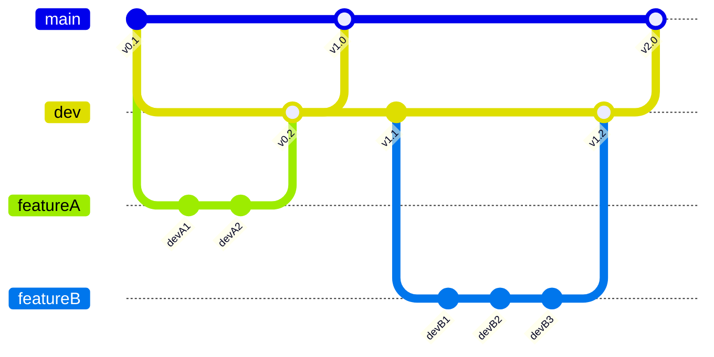

# Git
* version control
* local

---

# GitHub

---
# Commands

```shell
git push
```

---

# Recommended Workflow

```mermaid
gitGraph
    commit id: "v0.1"
    branch dev
    checkout dev
        branch featureA
        checkout featureA
            commit id: "devA1"
            commit id: "devA2"
        checkout dev
        merge featureA id: "v0.2"
    checkout main
    merge dev id: "v1.0"
    checkout dev
    commit id: "v1.1"
        branch featureB
        checkout featureB
        commit id: "devB1"
        commit id: "devB2"
        commit id: "devB3"
    checkout dev
    merge featureB id: "v1.2"
    checkout main
    merge dev id: "v2.0"
    %% rebase featureB
```