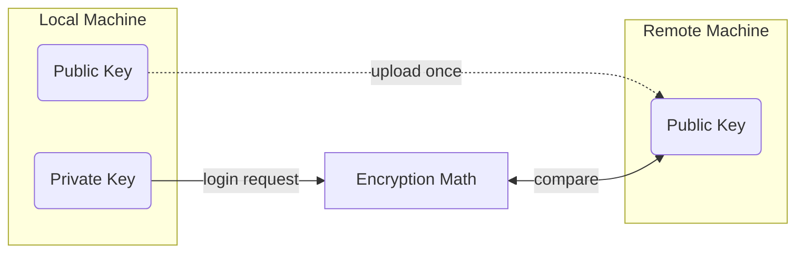

<!-- _class: titleslide -->
# Connect
## SSH-Keys


<div class="footnote">Image generated with ChatGPT</div>

---
# SSH-Keys?
* secure way to access remote machines without a password
* based on encryption
> NEVER share the private key with anyone!



---
# Generating a Key-Pair
<!-- `ed25519` ... encoding protocol -->

* see [GitHub](https://docs.github.com/en/authentication/connecting-to-github-with-ssh/generating-a-new-ssh-key-and-adding-it-to-the-ssh-agent) for details 
```bash
#generate a key-pair
ssh-keygen -t ed25519 -f <key filename> -C <your email/user>                                                    
```
```bash
#content of ~/.ssh/config
Host <shortcut to use for connecting>
    HostName <host address>
    User <username>
    ForwardAgent yes
	ForwardX11 yes    #for interactive window forwarding
    IdentityFile <path to private key>
Host github #for github
    HostName github.com
    User git
    IdentityFile ~/.ssh/github                                                                           
```
* copying to remote host
```bash
ssh-copy-id -i <key filename> user@host                                                                         
```
---
## SSH-Agent Not Running?
* activate
```bash
eval "$(ssh-agent -s)"                          #linux
Invoke-Expression -Command "$(ssh-agent -s)"    #windows 
```
* add key to session
```bash
ssh-add <key name>
```