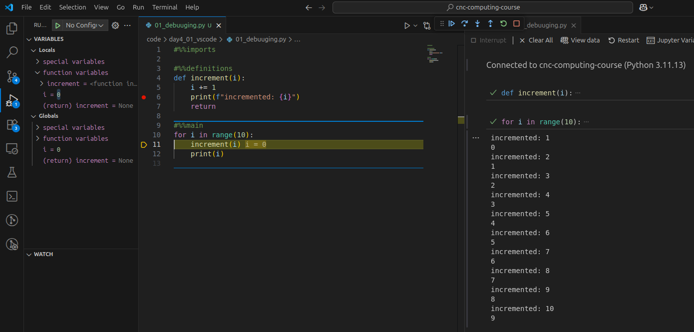

<!-- _class: titleslide -->
# Convenience
## Useful Things in VSCode

Image generated with ChatGPT

---

# $\LaTeX$ in [VSCode](https://code.visualstudio.com/)

* for Linux
    * follow instructions of official [LaTeX Workshop](https://marketplace.visualstudio.com/items?itemName=James-Yu.latex-workshop) extension
        * I use their recommended configuration i.e., [TeX Live](https://www.tug.org/texlive/)
* for Mac
    * install [BasicTeX](https://www.tug.org/mactex/morepackages.html)
    * add to path (i.e. in add to `.bash_profile`)
        * `PATH=/usr/local/texlive/<basic_tex_version>`
        * `PATH=/usr/local/texlive/<basic_tex_version>/bin/<...>/pdflatex  #just to be safe`
    * install latexmk `sudo tlmgr install latexmk`
    * add to path (i.e. in add to `.bash_profile`)
        * `PATH=/Library/TeX/texbin/latexmk`
    * you might have to change ownership and rights of [BasicTeX](https://www.tug.org/mactex/morepackages.html)
        * `chown -R <username> <path/to/texlive>`
        * `cmod 777 -R <path/to/texlive>`
* restart [VSCode](https://code.visualstudio.com/) (maybe even your machine)
* viewing produced pdf: `ctrl+alt+V`
* building pdf `ctrl+alt+B`

---
# Debugger

* efficient debugging of your code
* works also on OzStar

> be careful with **active** environments

---

# Other Useful Extensions
* [CodeSnap](https://marketplace.visualstudio.com/items?itemName=adpyke.codesnap)
* [DataWrangler](https://marketplace.visualstudio.com/items?itemName=ms-toolsai.datawrangler)
* [Git Graph](https://marketplace.visualstudio.com/items?itemName=mhutchie.git-graph)
* [Jupyter](https://marketplace.visualstudio.com/items?itemName=ms-toolsai.jupyter)
* [Markdown Preview Mermaid Support](https://marketplace.visualstudio.com/items?itemName=bierner.markdown-mermaid)
* [Python](https://marketplace.visualstudio.com/items?itemName=ms-python.python)
* [Rainbow CSV](https://marketplace.visualstudio.com/items?itemName=mechatroner.rainbow-csv)
* [Remote SSH](https://marketplace.visualstudio.com/items?itemName=ms-vscode-remote.remote-ssh)
* [vscode-pdf](https://marketplace.visualstudio.com/items?itemName=tomoki1207.pdf)