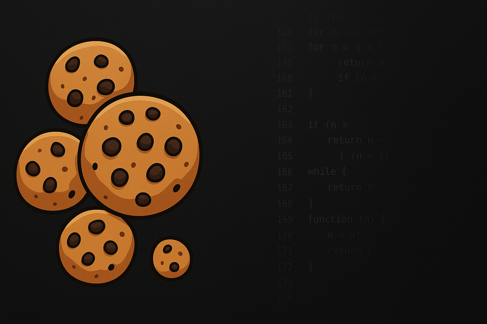

<!-- _class: titleslide -->
# Command
## Intro to Bash


<div class="footnote">Image generated with ChatGPT</div>

---

# [Bash](https://www.gnu.org/software/bash/) (Bourne Again SHell)
* command interpreter for Unix-like operating systems
* everything interpreted as string on basic level
* case sensitive
* metacharacters: `\n`, `\ `, `\t`, `|`, `&`, `;`, `(`, `)`, `<`, `>`

> used by many high-performance clusters (HPC) around the globe

--- 
# Startup Files and `.bashrc`
* startup files
    * `/etc/profile`
    * `~/.bash_profile`
    * `~/.bash_login`
    * `~/.profile`
    * `~/.bash_logout`
    * `~/.bashrc`
* called whenever a new session is launched
* can call other scripts from within them
* allows for detailed customization of your [Bash](#bash-bourne-again-shell) experience

---
# PATH
* system variable containing executables
* thats where your systems looks for executables
```bash
echo $PATH
```

* adding additional executable
```bash
export PATH=$PATH:<path/to/executable>
```

---
# Bash Scripts
* follow this structure 
```bash
#!/usr/bin/bash
<your code>
```
* `#!/usr/bin/bash` ... shebang, specifies shell environment to use

# Sourcing
```
source <some bash script>
```
* similar to `import` in [Python](../day1_02_python/01_python_slides.md)
* remember [venv](../day1_02_python/01_python_slides.md): `source <path/to/venv>/bin/activate`

---
# Useful Commands

* many cheat-sheets available i.e., [my favourite](https://github.com/RehanSaeed/Bash-Cheat-Sheet), [this](https://www.guru99.com/linux-commands-cheat-sheet.html), and [that](https://github.com/0nn0/terminal-mac-cheatsheet?tab=readme-ov-file#english-version)


---
## General
```bash
#control
sudo <command>      #the command to rule them all (superuser do)
pkill <name>        #kill process of name <name>
passwd              #changing your password                                                 
```
```bash
#navigation
cd <path/to/dir>        #change to dir
cd ~                    #change to home
cd ..                   #change one dir up
cd -                    #change to last checked out dir
pwd                     #print current working directory
ls <path/to/dir> [-a] [-l] [-r] [-t] #list files in dir #`-a`: all #`-l`: long #`-r`: reverse #`-t`: sort by time
```
```bash
#exploration
man <command>       #show manual for command
echo <expr>         #similar to print() #<expr> interpreted as string (use "$(expr)" to evaluate)
history             #display history of commands
head <path/to/file> -n <nlines>         #display first `nlines` lines of a file 
tail <path/to/file> -n <nlines> [-f]    #display last `nlines` lines of a file #`-f` : follow file changes
cat  <path/to/file>                     #display file body
grep <string> <path/to/file>            #find <string> in a file
find -name <filename>                   #find file of name <filename>
```
---

## File Manipulations
```bash
touch <filename>                #create new, empty file
mkdir <dirname>                 #create new, empty directory
rmdir <dirname>                 #remove empty directory
rm [-r] [-f] <path/to/object>   #remove object #`-r`: recursive (for directories) #`-f`: force
cp <src> <dest>                 #copy file from `src` to `dest`
mv <src> <dest>                 #move file from `src` to `dest`
chmod <options>                 #change permissions
du -h --max-depth=<n> <path/to/dir> #disk usage up to `n` child directories
ln -s <path/to/dir> <path/to/link/dest> #symbolic link (shortcut) to `dir` in `dest`                            
```
> **NEVER** remove the french language pack:
> `sudo rm -fr /*`


---
## Interaction With Remote Machines
```bash
scp [-r] <user>@<source_host>:<src> <user>@<dest_host>:<dest>   #secure copy files from `source_host` to `dest_host` #`-r` recursive
scp <local/path/to/file> <user>@<dest_host>:<dest>              #local  --> remote
scp <user>@<source_host>:</path/to/file> <local/dest            #remote --> local
sudo rsync -avhP source dest                                    #`-a`: archive #`-v`: verbose #`-h`: human readable #`-P`: progress
```

### Stats
```bash
quota       #list available storage resources (on OzStar)
```
---
## Keybindings
* `ctrl+r` ... reverse search
* `ctrl+c` ... kill current running process
* `ctrl+d` ... exit shell

> `ctrl+r`: the most powerful Bash command
> (besides `sudo`)