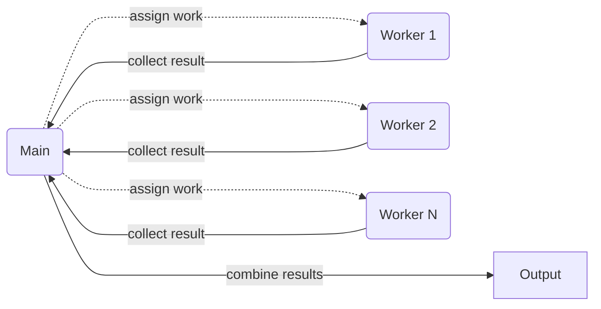
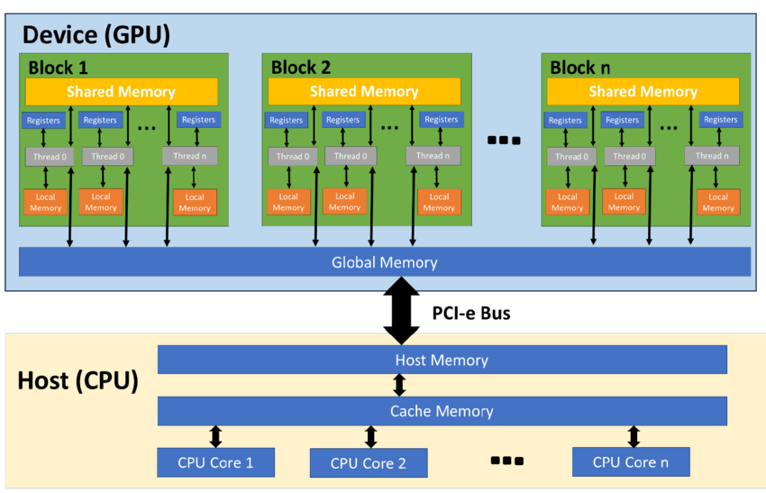

<!-- _class: titleslide -->
# Compute
## Parallel Computation and GPU

Image generated with ChatGPT

---
# Embarassingly Parallel Problems
* each task independent
* shared memory
* easy to parallelize

---
<!-- thread: each core can have several threads (each chrome tab is a thread) -->
# Threading
* easy to set up
* good for [embarassingly parallel problems](#embarassingly-parallel-problems)
* shared memory
* can only use a single machine
    * but multiple cores
* [Python](../day1_02_python/01_python_slides.md): [joblib](https://joblib.readthedocs.io)

---
# MPI (Message Passing Interface)
* more complex
* each process has its own memory
* can scale across multiple machines
* can adapt to more settings
* [Python](../day1_02_python/01_python_slides.md): [mpi4py](https://mpi4py.readthedocs.io/en/stable/)
    * requires [OpenMPI](https://docs.open-mpi.org/en/v5.0.x/index.html) to be installed
    * done for you on OzSTAR

---
# GPU Computing
<!-- TPU: Tensor Processing Unit -->
<!-- PPU: Physics Processing Unit -->

Image Credit: <a href=https://supercomputing.swin.edu.au/docs>Irfan et al., 2023</a>

* GPU: highly specialized hardware
* designed for [embarassingly parallel problems](#embarassingly-parallel-problems)
* huge in Deep Learning
    * batch-wise gradient computation
* each block has it's own memory (shared across block)
    * each thread within a block has it's own local memory
* more specialized variants exist: TPU, PPU

> software needs to be designed for GPU-computation!

