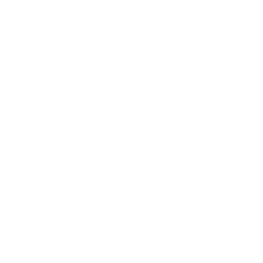
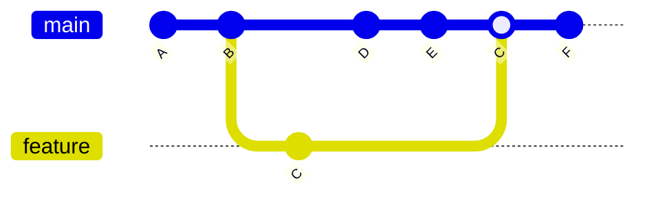
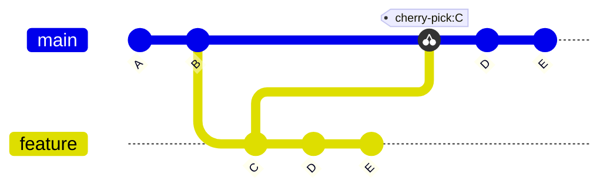
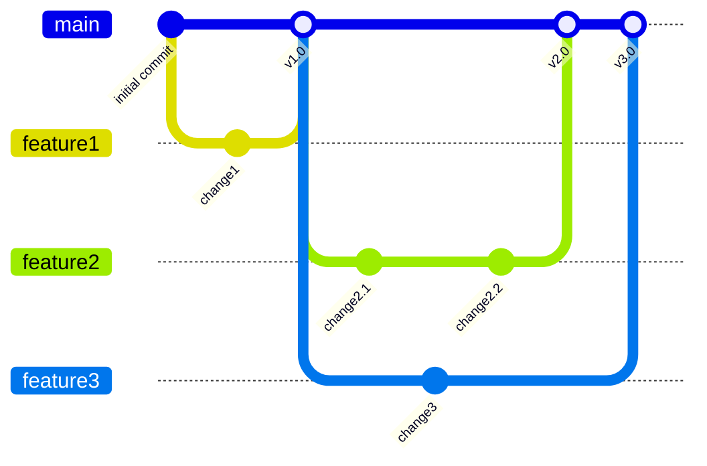
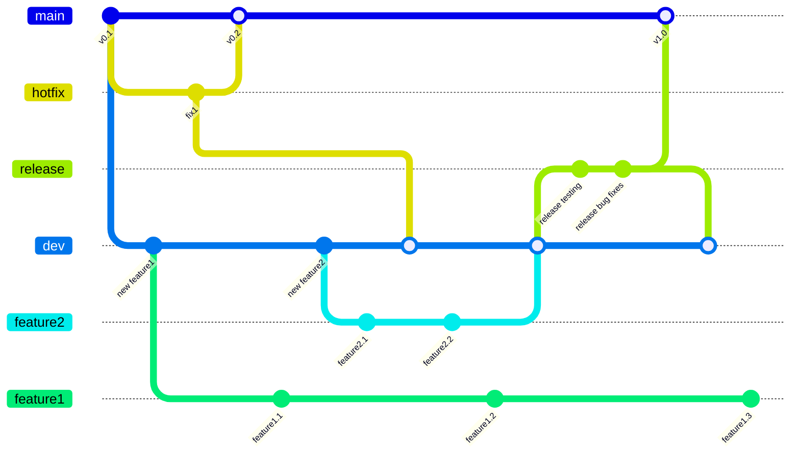
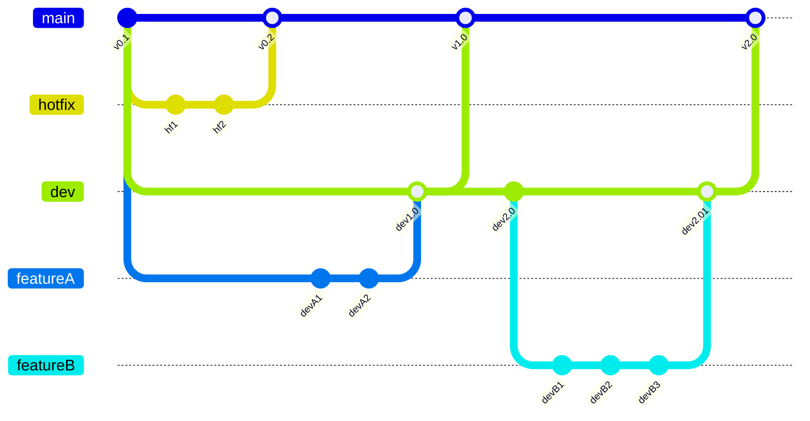
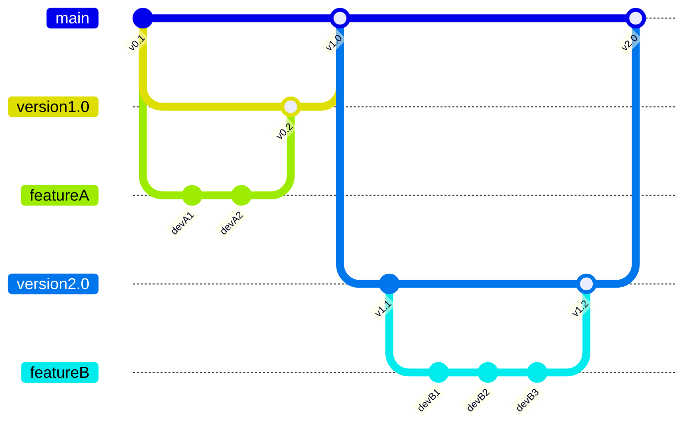

<!-- _class: titleslide -->
# Control 
## Git and Github


<div class="footnote">Image generated with ChatGPT</div>

---

# [Git](https://git-scm.com/)
    <!-- placeholder for placment -->

    <!-- placeholder for placment -->

    <!-- placeholder for placment -->

* **local**
* version control
    * editing code without affecting latest working version
* crucial for collaborating on code
* useful for personal projects
* [learn/try interactively](https://learngitbranching.js.org/)


# [GitHub](https://github.com/)
* **remote (cloud)**
* allows to share code with others
<!-- * let's look at a [remote repo](https://github.com/TheRedElement/LuStCodeSnippets/tree/main) -->
* let's look at a [remote repo](https://github.com/swincas/cnc-computing-course.git)

---
# Useful Commands

```bash
#getting the repo
git clone <url/to/repo>
git fork <url/to/repo>
```

```bash
#version update
git status
git pull                        #remote
git diff
git add <yourfiles>
git commit -m "<your message>"
git push                        #remote
git remote [-rm <file>]         #remote interaction                                             
```

```bash
#branching
git checkout [-b] <branchname>
git branch [-a]
git merge <branch to be merged into current branch>
git rebase <branch to be rebased onto current branch>
git log --graph --oneline --decorate --all --color                                      
```

---

## Rebase vs Merge

### Merge
* in principle automatic (requires user action for merge conflicts)



### Rebase



---
## Clone vs Fork

### Clone (Copy Linked to Original)
* sets original repository as origin
* you can sync changes to your local copy if the devs updated the code
* `push` changes will be reflected in the original (if you have permission)

### Fork (New, Isolated Copy)
* completely new copy of repo
    * you are in control of that copy
* original developers do not know about forked copy
* `push` changes only affect your forked copy
* edits to original can be suggested via [pull requests](#pull-requests)

---
## Pull Requests
* [fork](#fork-new-isolated-copy) repository you want to contribute to
* `git clone` [forked repo](#fork-new-isolated-copy) to your local machine
* create new working branch: `git checkout -b <your feature>`
* make changes
* `add`, `commit`, `push`
* on [GitHub](#github)
    * navigate to `pull request` tab
    * click `new pull request`
    * select you want to merge from on the right (your new branch)
    * select branch to merge into on the left (main of original repo)
    * click `create pull request`

---
# Industry Workflows
---

## GitHub Flow


* lightweight
* small projects
* straightforward
* continuous integration
* fast feedback

---

## Git Flow


* more complex
* allows parallel development
* main branch remains stable


---

## Dev-Feature (Simplification of [Git Flow](#git-flow))



* my simplification of [Git Flow](#git-flow)
* stable main branch
* no parallel development of features
* dev for nightly builds

---
## Version-Feature



* my enhancement on [GitHub Flow](#github-flow)
* stable main branch
* version branches
        * keep history
        * nightly builds
* feature branches for each version
* no parallel development of features


---
# Submodules
* linking to other git-repos
* repo-within a repo
    * changes synced upon `git pull`

```bash
#linking
git submodule add <url/to/git repo>
```

```bash
#unlinking
git config -f .gitmodules --remove-section submodule.path/to/submodule #remvove submodule entry
git config -f .git/config --remove-section submodule.path/to/submodule #remove submodule from git config
git rm --cached path/to/submodule #remove submodule from git's tracking
rm -rf path/to/submodule/.git #delete .git directory (convert to normal directory)

#track changes
git add path/to/submodule
git commit -m "Convert submodule to regular directory"
```

---
# [VSCode](https://code.visualstudio.com/)
* suite of tools for git-incorporation
    * [Git Graph](https://marketplace.visualstudio.com/items?itemName=mhutchie.git-graph)
    * `Source Control` (shipped by default)
    * [VSCode](https://code.visualstudio.com/) settings sync
        * through login with [GitHub](https://github.com/) account

---
# Action!

> 1. clone the repo used in this course:
> [https://github.com/swincas/cnc-computing-course.git](https://github.com/swincas/cnc-computing-course.git)

> 2. on [GitHub](http://github.com/), init a new repo that can host all your useful code-snippets
> 3. based on one of the [industry workflows](#industry-workflows), create a `dev` branch that will host your developments detached from `main`
> 4. modify the `README.md` file and push the changes

---
# Good To Know

## [GitHub Education](https://github.com/education/students)
* requires picture of student card
* benefits
    * free [GitHub pro](https://docs.github.com/en/get-started/learning-about-github/githubs-plans) account
    * [GitHub Copilot](https://github.com/features/copilot)
    * unlimited repos
    * cloud coding space
    * loads of courses
