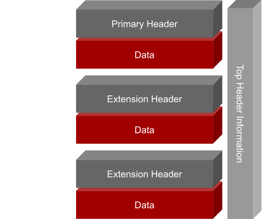

<!-- _class: titleslide -->
# Catalog
## Data Formats


<div class="footnote">Image generated with ChatGPT</div>

---
## [FITS](https://docs.astropy.org/en/latest/io/fits/index.html)
<!-- FITS: Flexible Image Transfer Format -->


<div class="footnote">Image credits: Lukas Steinwender</div>

* file-system designed for astronomy
* hierarchy
    * HDU (Header Data Unit)
        * Header: ASCII table
        * data: binary table (ND-arrays)
    * Primary HDU
        * describes data
        * data must be image or no data at all
    * Extension HDU
        * optional
        * various data types

---
### Interacting With [FITS](https://docs.astropy.org/en/latest/io/fits/index.html) Files


```python
#reading
from astropy.io import fits
with fits.open(<path/to/file.fits>, "r") as hdul:                                         
    primary_header = hdul[0].header
    primary_data = hdul[0].data
    extension_header1 = hdul[1].header
    extension_data = hdul[1].data

hdul = fits.open(<path/to/file.fits>)
fits.close()                            #never forget to clean up!
hdul.info()
```
* for writing see `makefits()` in [data_formats.py](./01_data_formats.py)
---
## Industry Standards: [Apache Parquet](https://parquet.apache.org/)
* accessible through [Pandas](https://pandas.pydata.org/docs/reference/api/pandas.read_parquet.html), [polars](https://docs.pola.rs/api/python/stable/reference/api/polars.read_parquet.html)
* open source
* lightweight

> industry standard for cloud based data lakes
```python
import pandas as pd
df = pd.read_parquet(<path/to/file.parquet>)
df.to_parquet(<path/to/file.parquet>)
```
---

## Industry Standards: [HDF5](https://www.hdfgroup.org/solutions/hdf5/)
* accessible through [h5py](https://docs.h5py.org/)
* freely availble
* strong compression
* can be sliced without loading the entire file in memory
* organized similar to a file explorer

> industry standard for non-tabular data
```python
import h5py
f = h5py.File(<path/to/file.h5>, "r")                                       #reading
f.close()
f2 = h5py.File(<path/to/file.h5>, "w")                                      #creating file
grp = f2.create_group(<name/of/group>)                                      #creating a group
dataset1 = grp.create_dataset(<name/of/dataset>, <shape>, dtype=<datatype>) #add data
dataset2 = grp.create_dataset(<name/of/dataset>, data=<your_data_array>)    #add data
```