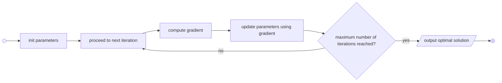

<!-- _class: titleslide -->
# Consistency
## Good Practises in Coding


<div class="footnote">Image generated with ChatGPT</div>

---

# Main Criteria

* **readable**/**understandable**
    * others can easily understand
    * also in the future you will know what the code does
    * no need for explanations when shared with other
    * self-contained
* **reusable**
    * can be applied to variety of situations
    * no need to rewrite everything, recycle existing code
* **testable**
    * easy to debug

---
# Code Planning

## Questions to Ask
* what shall my code do
* what are the steps to get there
* how do I complete each step
    * input, methods, output

---
## Pseudocode

> description of an algorithm in a mixture of plain english and programming language conventions

* easy to understand
* language independent
* focus on **fundamental logic** without worrying about syntax
* should (in principle) compile without errors


```julia
#pseudocode for gradient decent
choose x_0, learning rate: tau
for all k >= 0 do
    x_(k+1) = x_k - tau * gradient(f(x_k))
end for           
```

---
## Flowcharting
* graphical alternative to [pseudocode](#pseudocode)
* start simple, get more elaborate (function inputs, memory allocations, ...)
* tools
    * pen and paper
    * [Mermaid](https://mermaid.js.org/)
* for the [pseudocode](#pseudocode) example:


---

# Naming Conventions
<!-- note on tables: I name all columns lowercase, connected with underscores, ASCII characters only -->
<!-- PEP8: python standards -->
<!-- VSCode linting during development: doesn't highlight custom modules that don't comply with naming conventions -->

* `camelCase`, `PascalCase`, `snake_case`, `SCREAMING_SNAKE_CASE`

> try to follow the community of the language you're using

* examples from [PEP 8](https://peps.python.org/pep-0008/)
    * modules: short, `snake_case`
    * classes: `PascalCase`
    * methods: `snake_case`
    * functions: `snake_case`
    * variables: `snake_case`
    * constants: `SCREAMING_SNAKE_CASE`
* tabular data
    * find your own style (I use `<quantity>_<context>_<source>[_e] [<[unit]>]`)

---
# Refractoring
<!-- see repo-template for examples -->
* break big chunks into functions and classes
    * add comments and docstrings
    * checkout [this repo](https://github.com/TheRedElement/RepoTemplate_LuSt/blob/main/code/_projectbuildingblocks.py) for a template
* catalog sets of function with similar context into importable modules
    * checkout [this repo](https://github.com/TheRedElement/LuStCodeSnippets/blob/dev/lust_codesnippets_py/astronomy/absmag.py) for an example
    * [logging](./../session1_02_python/01_python_slides.md) for insight and debugging

# Testing
* remember [session1_02_python](../session1_02_python)?
    * [cn5_test.py](../../test/cn5_test.py) was the example we had
---
# 3-Step Process
1. make it **work**
    * ensure correct outputs and behavior
1. make it **right**
    * make readable
    * make maintainable
    * figure out correct structure
1. make it **fast**
    * optimize performance

<div class="footnote">Quote by Kent Beck</div>

---
# Conquer the Commandline

* powerful for code that is executed often

* can also be done using python
```bash
python <yoursript.py> [args]
```
* use [argparse](https://docs.python.org/3/library/argparse.html) for variability
    * see [commandlinetool/](./commandlinetool/) for an example
```bash
#run from project root
python3 content/session3_03_good_practises/commandlinetool/src/commandlinetool/main.py 1 -o "optarg"
```

* [uv](../session3_03_uv_mise/01_uv_mise.md) allows easy creation of commandline tools
> use a separate uv project for each commandline tool
